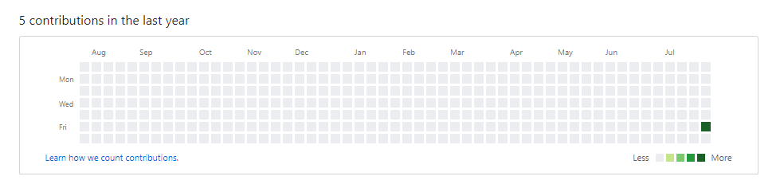
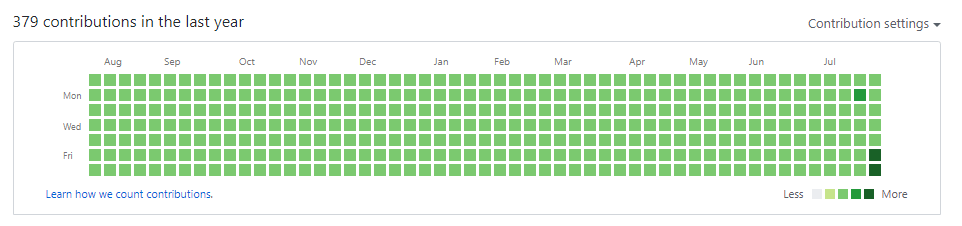

# 运行命令示范

-   它可以做什么？
    -   让你的 github 小绿点从无到有
    -   
    -   
-   使用步骤

    1.  准备好一个垃圾仓库，可以是私仓 ，但是接下来的 public key 必须有访问/push 权限，！请务必不要应用于正式的生产仓库！
    2.  使用 ssh-keygen 生成 publickey ，并且`加入到 github 的 SSH 里`，将下面的`$GIT_EMAIL`替换为 Github 邮箱，且务必与下面的 GIT_EMAIL 保持一致
        -   `ssh-keygen -t rsa -N "" -f ~/.ssh/id_rsa -q -C "$GIT_EMAIL"`
        -   Github 地址：`https://github.com/settings/ssh/new`
    3.  将得到的 `id_rsa`，`id_rsa.pub` 复制到该目录的根路径内
    4.  Build 容器
        docker build \
        --build-arg GIT_USERNAME=xxx \
        --build-arg GIT_EMAIL=xxx@yyy.com \
        --build-arg GIT_REPO=xxxxxxxxx \
        --no-cache \
        -t auto_fill .
    5.  跑起来这个容器 `docker run --rm -d auto_fill`

-   请将 build 的时候输出的 public key，添加到 github 的仓库里
-   GIT_REPO 务必使用 SSH 方式，类似于`git@github.com:xxxxx/yyy.git`
-   上述操作建议均在服务器中运行
